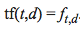
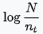
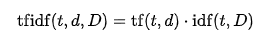

## Alexa Feature Recommendations

  

By Lyssa Treibitz
October 2018

### Data Source

Coming from a customer success background, I am constantly searching for ways to find and analyze feedback. Building on the idea that quantitative feedback is only one piece of the puzzle, I wanted to breakdown qualitative data to attempt to identify the insights within that could inform future iterations of the product, customer success and marketing strategies. The data I drew my analysis from was ~13,000 customer reviews of Amazon's Echo Dot (2nd Generation).  There were six columns included in the file:

    - Date of Review (dd/mm/yy)
    - Review Header (string)
    - Review Text (string)
    - Review Rating (integer)
    - Review Helpfulness (integer)
    - Echo Dot Color (string)

The reviews are mostly positive as shown by the below distribution of the star ratings:

**Example of a 5-star review taken from Amazon:**

**Example of a 1-star review taken from Amazon:**

### Natural Language Processing

##### Bag-of-Words Model

The Bag-of-Words Model (known also as the vector space model) is a simplifying representation of large amounts of text used in Natural Language Processing. It transforms all the words in a set of documents into a single list of unique words. It then creates a matrix, assigning each unique word to a column, and each document (in this case each review) to an individual row. As you can see in a simplified version below, each field is then assigned a numerical value based on the number of occurrences of each word in that particular document.

**Creating a list of unique words:**

**Assigning values to each field:**

#####  N-grams

N-grams are a continuous sequence of n number of words.  In certain cases, it is better to analyze text using sequences of words in order to derive a more complete context of meaning.  

**Example of a bi-gram:**

##### TFIDF

TFIDF stands for Term Frequency-Inverse Document Frequency.  This is a method for weighting different words based on their frequency within a given document and their frequency within the entire set of documents.  The idea behind this is that words appearing across a large number of documents are less significant.

The formula for TF is defined as:

Where you are counting the frequency of the words within a given document.

The formula for IDF is defined as:

Where you are taking the log of total documents divided by the number of documents a word appears in. In effect, penalizing words that appear across multiple documents.

And the formula for their combination is defined as:

In order to achieve a high TFIDF weight, words (or ngrams) must appear multiple times within a given document, but fewer number of times across the corpus of documents.

### Vectorizing

#### Cleaning

In order to prepare the reviews to be tranformed into a TFIDF matrix, a certain amount of cleaning needed to be done to avoid unnecessary word duplicates (i.e. alexa, Alexa, and alexa!)

    - Remove punctuation
    - Remove stopwords (words that appear frequently but have no relevant meaning)
    - Remove non-alphabetic characters
    - Strip extra spaces
    - Change all words to lowercase

#### K-means clustering

Once I created my TFIDF matrix, I decided to analyze the resulting data through clustering.  This allows you to see patterns in your text by clustering similar documents together. k-means clustering aims to partition each document into k clusters where each document belongs to the cluster with the nearest mean. In order to decide how many clusters I wanted to assign the data to, I created an elbow plot.  

However, since it didn't appear that the reviews could be readily clustered, I chose to "self-cluster" by separating the data into two sets of reviews, one with all 5 star reviews and another with all 1 star reviews. After converting each into their own TFIDF matrix, I organized each set into one cluster so I could find the documents and ngrams closest to the mean, indicating that they were the most representative of all the text.

### Results

|    | 4-gram_5_star_review           | 4-gram_1_star_review            |
|---:|:-------------------------------|:--------------------------------|
|  0 | add things shopping list       | not stay connected wifi         |
|  1 | add something shopping list    | play music already downloaded   |
|  2 | add items shopping list        | not worth money hope            |
|  3 | play music throughout house    | would not recommend anyone      |
|  4 | one upstairs one downstairs    | would not recommend product     |
|  5 | one living one bedroom         | half time doesnt answer          |
|  6 | easy set easy use              | play amazon prime music         |
|  7 | makes life much easier         | could get money back            |
|  8 | adding items shopping list     | every time ask something        |
|  9 | play music answer questions    | would not stay connected        |
| 10 | didnt think would like          | asking questions not really     |
| 11 | thinking getting another one   | almost completely stopped using |
| 12 | would highly recommend product | get questions answered not      |
| 13 | tp link smart plug             | would not connect wifi          |
| 14 | kids love asking questions     | not stay connected internet     |

There are clear takeways in the resulting n-grams of the 5 star and 1 star reviews. You can see multiple sentiments reflected that can inform the  future marketing and product iterations of the Echo dot.

### Future Work

For future iterations I would like to:

- Explore dividing the text into parts of speech to determine which verbs and adjectives are most associated with each review type.

- Question the underlying assumptions in the TFIDF matrix weighting

- Spend more time analyzing Review Helpfulness and potentially create an additional word weighting system that puts a heavier emphasis on reviews that people found more helpful.

- Create a review generator that, based on a given star value, creates a fake review representative of general sentiment for that rating.

### References

http://datameetsmedia.com/bag-of-words-tf-idf-explained/

https://towardsdatascience.com/clustering-based-unsupervised-learning-8d705298ae51

https://www.youtube.com/watch?v=FLZvOKSCkxY&list=PLQVvvaa0QuDf2JswnfiGkliBInZnIC4HL
