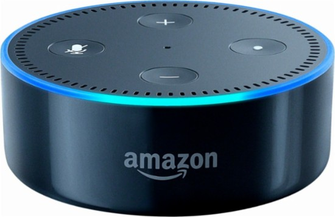

# alexa

### Data Source

Example of a 5-star Review:

Example of a 1-star Review:

### EDA

### Feature Engineering

### Modeling
### Results

|    | 4-gram_5_star_review           | 4-gram_1_star_review            |
|---:|:-------------------------------|:--------------------------------|
|  0 | add things shopping list       | not stay connected wifi         |
|  1 | add something shopping list    | play music already downloaded   |
|  2 | add items shopping list        | not worth money hope            |
|  3 | play music throughout house    | would not recommend anyone      |
|  4 | one upstairs one downstairs    | would not recommend product     |
|  5 | one living one bedroom         | half time doesn answer          |
|  6 | easy set easy use              | play amazon prime music         |
|  7 | makes life much easier         | could get money back            |
|  8 | adding items shopping list     | every time ask something        |
|  9 | play music answer questions    | would not stay connected        |
| 10 | didn think would like          | asking questions not really     |
| 11 | thinking getting another one   | almost completely stopped using |
| 12 | would highly recommend product | get questions answered not      |
| 13 | tp link smart plug             | would not connect wifi          |
| 14 | kids love asking questions     | not stay connected internet     |

### Future Work
### References
