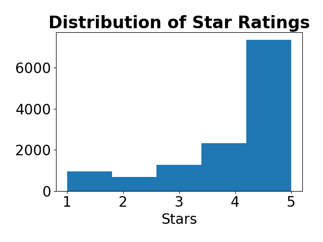
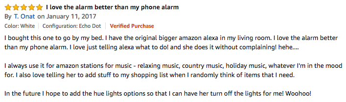
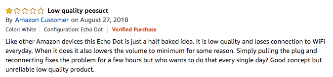
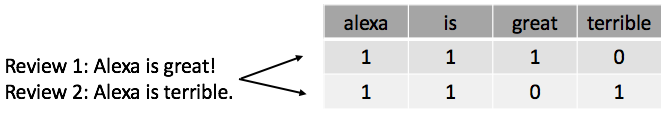
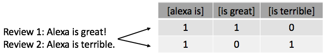
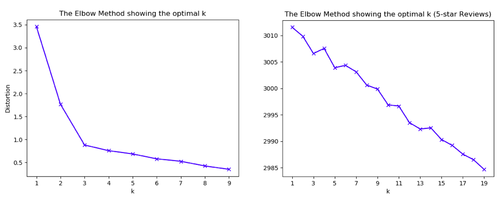

## Alexa, open the pod bay doors.

  

### Data Source

The data I drew my analysis from was ~13,000 reviews of Amazon's Echo Dot (2nd Generation).  There were four columns in the file:

    - Date of Review (dd/mm/yy)
    - Review Header (string)
    - Review Text (string)
    - Review Rating (integer)

The reviews are mostly positive as shown by the below distribution of the star ratings:

Example of a 5-star review taken from Amazon:

Example of a 1-star review taken from Amazon:

### Natural Language Processing

##### Bag-of-Words Model

The Bag-of-Words Model is a simplifying representation of large amounts of text used in Natural Language Processing.  It is also known as the vector space model. It transforms all the words in a set of documents into a single list of unique words and then creates a matrix, assigning each unique word to a column, and each document (in this case each review) to an individual row. As you can see in a simplified version below, each field is then assigned a numerical value based on the number of occurrences of each word in that particular document.

Creating a list of unique words:

Assigning values to each field:

#####  N-grams

N-grams are a continues sequence of n number of words.  In certain cases, it is better to analyze text using sequences of words in order to derive a more complete context of meaning.  

Here is an example of a bi-gram:

##### TFIDF

TFIDF stands for Term Frequency-Inverse Document Frequency.  This is a method for weighting different words based on their frequency within a given document and their frequency within the entire set of documents.  The idea behind this is that words appearing across a large number of documents are less significant.

### Modeling

#### Cleaning

In order to prepare the reviews to be tranformed into a TFIDF matrix, a certain amount of cleaning needed to be done to avoid unnecessary word duplicates (i.e. alexa, Alexa, and alexa!)

    - Remove punctuation
    - Remove stopwords (words that appear frequently but have no meaning)
    - Remove non-alphabetic characters
    - Strip extra spaces
    - Change all words to lowercase

#### K-means clustering

Once you've created your TFIDF matrix, another way of analyzing the resulting data is through clustering.  This allows you to see patterns in your text by clustering similar documents together. In order to decide how many clusters you want to assign the data to, you can create an elbow plot.  

However, since it didn't appear that the reviews could be readily clustered, I chose to "self-cluster" by separating the data into two sets of reviews, one with all 5 star reviews and another with all 1 star reviews. After converting each into their own TFIDF matrix, I organized each set into one cluster so i could find the documents and ngrams closest to the mean, indicating that they were the most representative of all the text.

### Results

|    | 4-gram_5_star_review           | 4-gram_1_star_review            |
|---:|:-------------------------------|:--------------------------------|
|  0 | add things shopping list       | not stay connected wifi         |
|  1 | add something shopping list    | play music already downloaded   |
|  2 | add items shopping list        | not worth money hope            |
|  3 | play music throughout house    | would not recommend anyone      |
|  4 | one upstairs one downstairs    | would not recommend product     |
|  5 | one living one bedroom         | half time doesn answer          |
|  6 | easy set easy use              | play amazon prime music         |
|  7 | makes life much easier         | could get money back            |
|  8 | adding items shopping list     | every time ask something        |
|  9 | play music answer questions    | would not stay connected        |
| 10 | didn think would like          | asking questions not really     |
| 11 | thinking getting another one   | almost completely stopped using |
| 12 | would highly recommend product | get questions answered not      |
| 13 | tp link smart plug             | would not connect wifi          |
| 14 | kids love asking questions     | not stay connected internet     |

There are clear takeways in the resulting n-grams of the 5 star and 1 star reviews. You can see multiple sentiments reflected that can inform the  future marketing and product iterations of the Echo dot.

### Future Work

For future iterations I would like to explore dividing the text into parts of speech to determine which verbs and adjectives are most associated with each review type.

### References

http://datameetsmedia.com/bag-of-words-tf-idf-explained/

https://towardsdatascience.com/clustering-based-unsupervised-learning-8d705298ae51

https://www.youtube.com/watch?v=FLZvOKSCkxY&list=PLQVvvaa0QuDf2JswnfiGkliBInZnIC4HL
